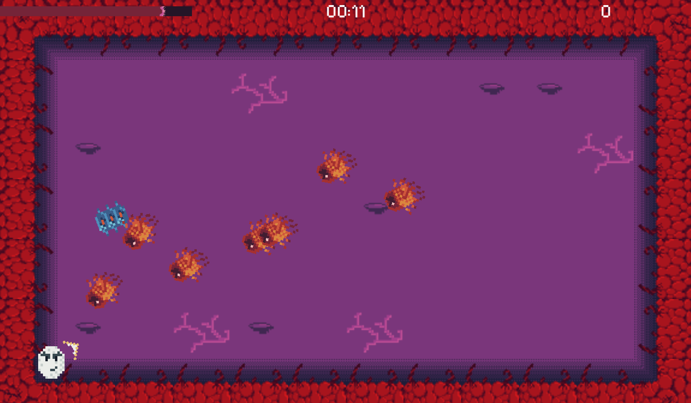
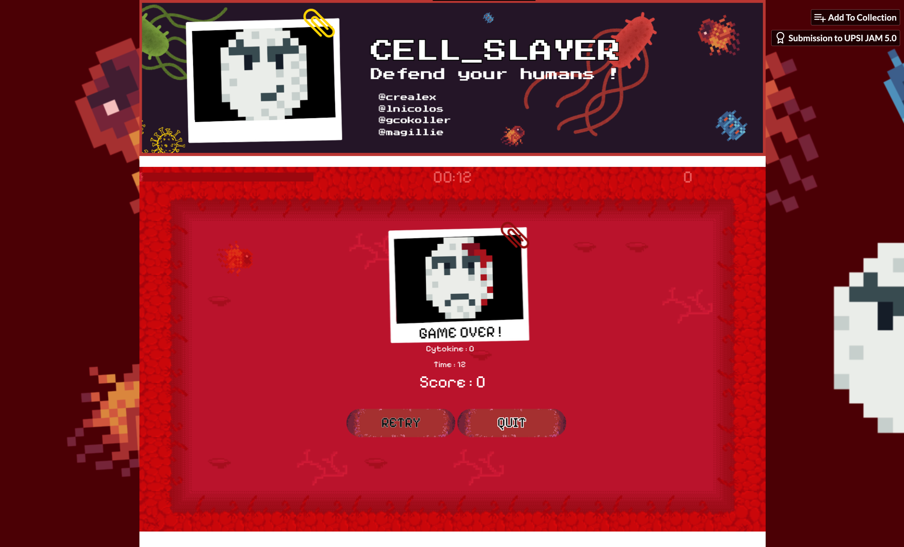

## Cell Slayer

<table>
  <tr>
    <td align="center">
      
    </td>
    <td align="center">
      
    </td>
  </tr>
</table>

## 🎮 Gameplay  

🔹 **Esquive les ennemis** est tire leur dessus !  
🔹 **Survis le plus longtemps possible** pour battre ton record   
🔹 **Incarne une globule blanche et combat les cellules,** Attention celles-ci se *split* lorsqu'on les touche ! ⏳  

## 🛠️ Développement  

Ce jeu a été **développé sous Godot Engine**, un moteur de jeu open-source puissant et flexible.  
Grâce à **Godot**, j'ai pu créer un gameplay fluide et réactif, parfait pour un jeu basé sur l'esquive et la survie.  

## 🚀 Jouer au jeu  

[Jouer sur itch.io](https://magillie.itch.io/cell-slayer) *(le jeu est jouable sur un navigateur Chromium)* 
